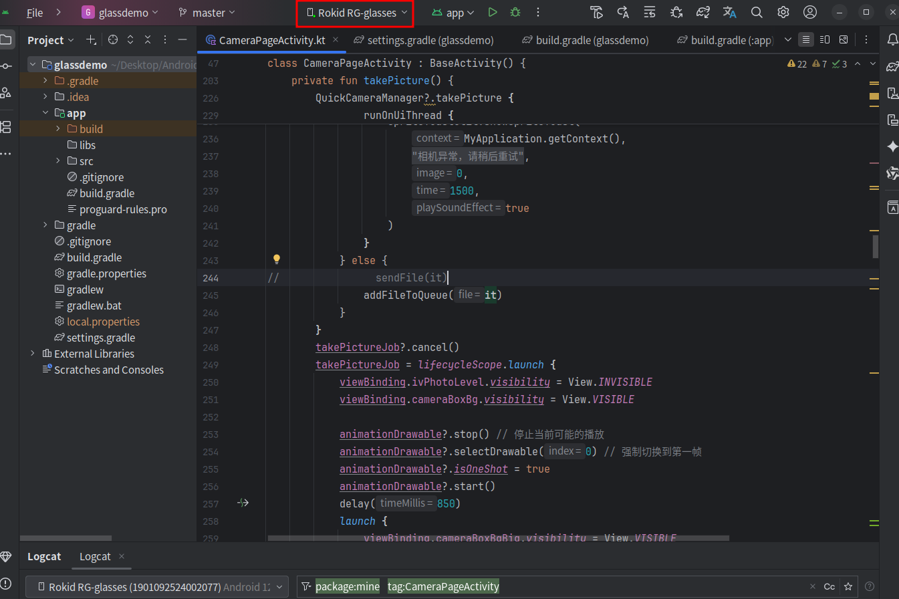
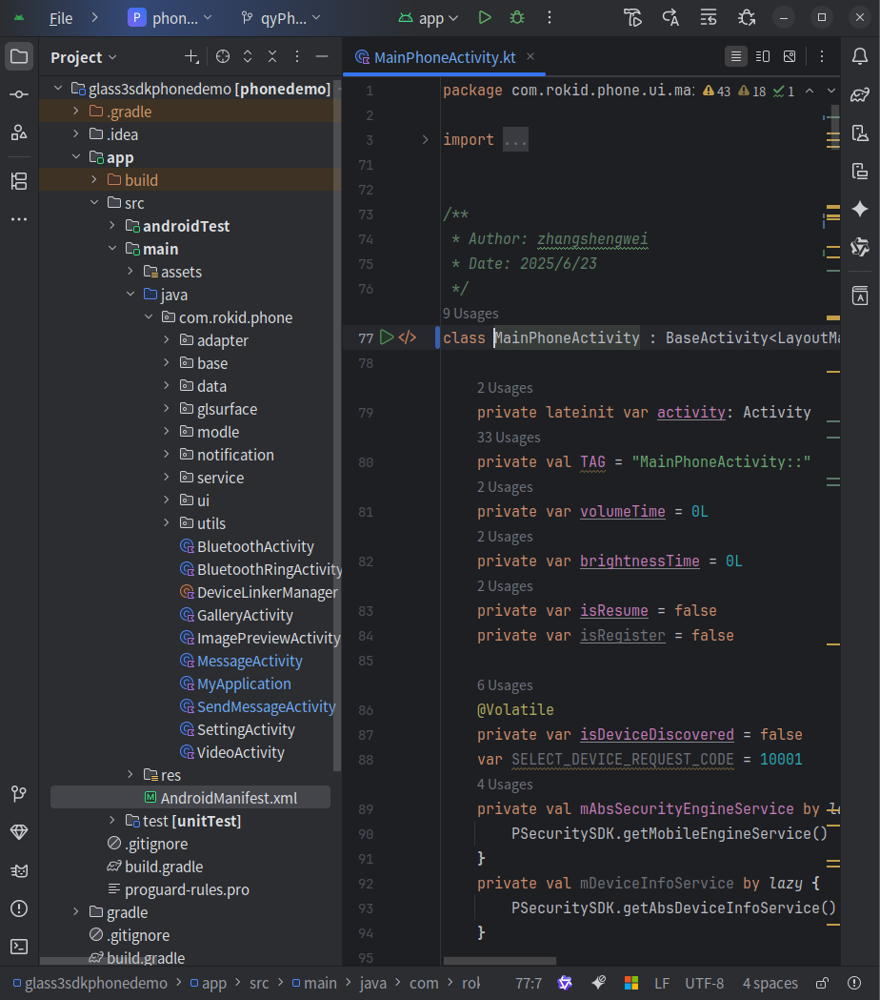

# Demo 运行指南

Demo 工程用于帮助开发者快速理解手机端与眼镜端的协作方式。建议先跑通 Demo，再根据业务场景查看对应示例和 API 参考。如果你想先看完整演示，可以跳转到 [五分钟快速构建应用](../terminal-sdk/getting-started/视频教程.md#_1-五分钟快速构建应用) 视频。

## 获取 Demo

Demo 源码托管在 GitHub：

[RokidSuuport/glass3_sdk_demo](https://github.com/RokidSuuport/glass3_sdk_demo)

推荐使用 HTTPS 克隆：

```bash
git clone https://github.com/RokidSuuport/glass3_sdk_demo.git
cd glass3_sdk_demo
```

如果你的 GitHub 账号已经配置 SSH 密钥，也可以使用 SSH 克隆。配置方法请参考 GitHub Issue：[协作者配置 SSH 密钥与提交代码说明](https://github.com/RokidSuuport/glass3_sdk_demo/issues/1)。

```bash
git clone git@github.com:RokidSuuport/glass3_sdk_demo.git
cd glass3_sdk_demo
```

后续获取官方更新时，在仓库目录执行：

```bash
git pull
```

以上操作只需要读取权限。后续的工程结构、构建命令和示例源码路径都基于该 GitHub 仓库。

## 工程结构

Demo 仓库包含两个独立 Android 工程：

- `glassdemo`：眼镜端 Demo
- `glass3sdkphonedemo`：手机端 Demo

这两个工程需要分别打开、分别构建。

## 环境要求

- Android Studio
- JDK 17
- Android SDK 34
- Android 手机真机
- Rokid Glass 3 设备

## 基础构建命令

### 构建眼镜端

```bash
cd glassdemo
./gradlew assembleDebug
```

### 构建手机端

```bash
cd glass3sdkphonedemo
./gradlew assembleDebug
```

## 首次调试建议

建议先运行手机端 Demo，再运行眼镜端 Demo。

手机端入口：

- `com.rokid.phone.ui.MainPhoneActivity`

眼镜端入口：

- `com.rokid.glass.HomeActivity`

## 运行前需要确认

### 鉴权参数

手机端 `MainPhoneActivity` 中的 `UserAuthInfo("", "")` 是占位值。如果在线能力需要鉴权，请填入商务提供的 API Key 鉴权信息。

### 权限

首次运行建议完整授权，尤其是：

- 蓝牙
- Wi-Fi / Nearby
- 相机
- 麦克风
- 通知监听
- 存储

### 硬件链路

以下能力强依赖真机和真实链路：

- 蓝牙连接
- Wi-Fi P2P
- 视频流预览
- 通知同步
- OTA
- 指环连接

## 运行 Demo

### 运行眼镜端 Demo

1. 使用 Glass3 数据调试线连接眼镜和电脑。
2. 确认 Android Studio 识别到设备，例如 `Rokid RG-glasses`。
3. 选择眼镜端应用模块。
4. 运行 `glassdemo` 到眼镜设备。



### 运行手机端 Demo

1. 使用 Android 手机连接电脑。
2. 选择手机端应用模块。
3. 安装并启动手机端 Demo。
4. 在手机端 Demo 中扫描并连接 Glass3。

手机端和眼镜端通过经典蓝牙连接成功后，即可互相发送消息和文件。



## 验证基础能力

建议按下面顺序验证：

| 步骤 | 验证内容 | 预期结果 |
| --- | --- | --- |
| 1 | SDK 初始化 | 手机端和眼镜端均初始化成功。 |
| 2 | 蓝牙扫描与连接 | 手机端可以扫描并连接 Glass3。 |
| 3 | 消息发送 | 手机和眼镜可以互相发送文本消息。 |
| 4 | 文件传输 | 小文件可以在手机和眼镜之间传输。 |
| 5 | P2P 连接 | 大文件或音视频能力可通过 P2P 通道传输。 |
| 6 | 媒体能力 | 可触发拍照、录像或实时预览。 |

如果蓝牙或 P2P 连接异常，请参考：

- [蓝牙连接排查](/faq/蓝牙问题排查.md)
- [P2P 连接排查](/faq/P2P问题排查.md)

## 下一步

- 如果要按能力查找示例，进入 [代码示例](./samples.md)。
- 如果要开发眼镜端 UI，先阅读 [眼镜端设计规范](/terminal-sdk/capabilities/设计规范.md)。
- 如果要查看接口定义，进入 [API 参考](/terminal-sdk/api-reference/)。
- 如果要查看应用安装包，进入 [应用下载](./apps.md)。
