# Glass3 SDK FAQ 总览

本页整理 Glass3 SDK 接入过程中最常见的问题。连接类问题请优先查看专项排查文档：

- [蓝牙连接排查](./蓝牙问题排查.md)
- [P2P 连接排查](./P2P问题排查.md)
- [自启动与按键自定义](./应用自启与按键拦截自定义.md)

## 1. 系统与开发环境

### SDK 支持哪些系统？

Glass3 SDK 面向 Android 应用开发，当前不支持 iOS 和纯血鸿蒙。

### 最低 Android 版本是多少？

建议使用 Android 7.0（API 24）及以上版本。具体项目请以当前 SDK 包和 Demo 工程的 Gradle 配置为准。

### 推荐开发环境是什么？

- Android Studio 2022 或更高版本
- JDK 17 或更高版本
- Kotlin 1.8.22 或更高版本
- Gradle 7.4.2 或更高版本

### 企业版和消费版系统怎么区分？

进入眼镜系统设置，查看系统版本。版本号中包含 `e` 的通常为工作/企业系统。

- 企业系统：使用 Rokid AI 企业版或企业版 Demo 连接。
- 消费系统：使用消费版 Rokid AI App，开发时需在眼镜设置中开启开发者模式。

Rokid AI 企业版下载二维码：


### 企业版系统切换到消费版系统可以进行系统升级?
企业版双系统的更新只能在企业版的app上进行

### 消费级和我们企业版是同一个sdk吗？

完全不相同

### 如何开启 debug 模式，app 上没找到？

企业版眼镜从今年1月份开始，默认有开发者权限，系统版本如果低于1月，眼镜端ota升级到新版本就会有开发者权限

### 消费版的眼镜sdk有链接吗

https://ar.rokid.com/sdk?lang=zh

## 2. UI 与显示

### 眼镜屏幕应该如何适配？

Glass3 屏幕为 480×640 竖屏坐标系，不支持系统级横竖屏切换。旧版应用如果强制横屏，建议移除：

```xml
android:screenOrientation="landscape"
```

推荐布局方式：

- 中间 480×400 区域放核心内容。
- 顶部 160px 和底部 80px 放次要信息。
- 如需横屏效果，应在竖屏画布内自行设计布局。

### 眼镜 UI 支持哪些颜色？

眼镜显示建议以绿色为主色，设计时避免依赖复杂色彩区分信息。

### 顶部文字出现倒影怎么办？

受光学结构影响，屏幕顶部约 40px 区域可能出现倒影。建议将关键文字、图标和按钮整体下移 40px。

### 出现闪屏怎么办？

建议将 Activity 背景设置为黑色，可以降低启动或切换页面时的闪屏感。

### 如何保持屏幕常亮？

```kotlin
override fun onResume() {
    super.onResume()
    window.addFlags(android.view.WindowManager.LayoutParams.FLAG_KEEP_SCREEN_ON)
}

override fun onPause() {
    super.onPause()
    window.clearFlags(android.view.WindowManager.LayoutParams.FLAG_KEEP_SCREEN_ON)
}
```

## 3. 设备与硬件

### 眼镜分辨率可以调整吗？

眼镜显示分辨率固定为 480×640，不能通过 SDK 修改。

### 眼镜摄像头支持自动对焦吗？

不支持。Glass3 使用定焦摄像头模组。

### 摄像头拍照分辨率可以选择吗？

可以选择摄像头输出分辨率，但显示分辨率仍是 480×640。常见拍照分辨率包括：

```text
4032x3024, 4000x3000, 3840x2160, 3264x2448, 3200x2400,
2560x1440, 2048x1536, 1920x1080, 1600x1200, 1280x720,
1024x768, 800x600, 640x480, 480x640, 320x240
```

### 眼镜有人脸识别的推荐距离吗？

最远约 5 米，3 米左右效果更稳定。

### 不同距离下条码识别表现如何？

条码识别效果会受到距离、环境光、条码尺寸、打印清晰度和摄像头画面稳定性的影响。调试时建议先在稳定光照下测试不同距离的表现，再结合业务场景确定推荐识别距离。

以下图片用于参考不同距离下的条码表现：

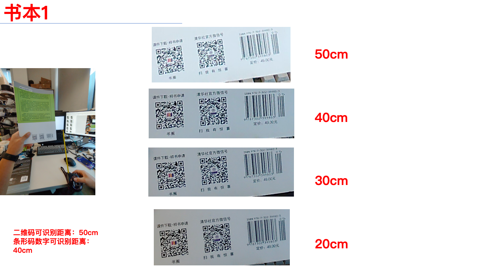
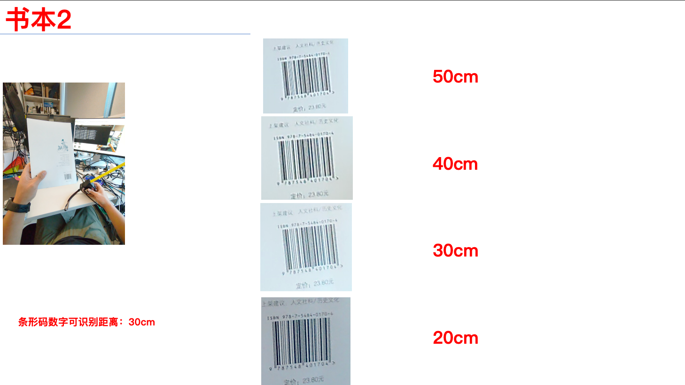
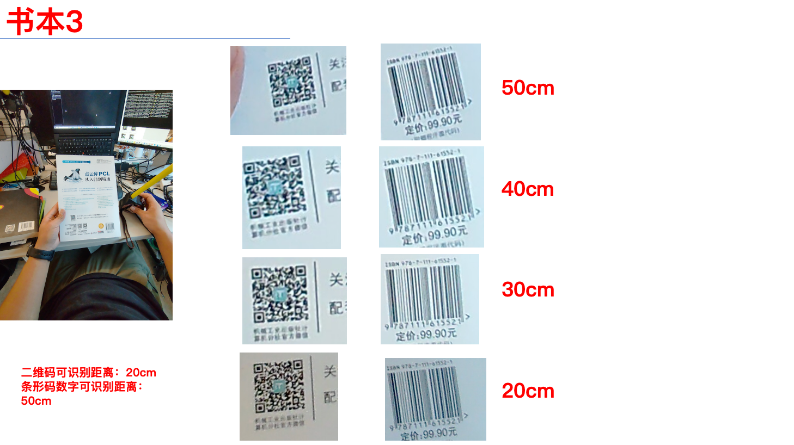
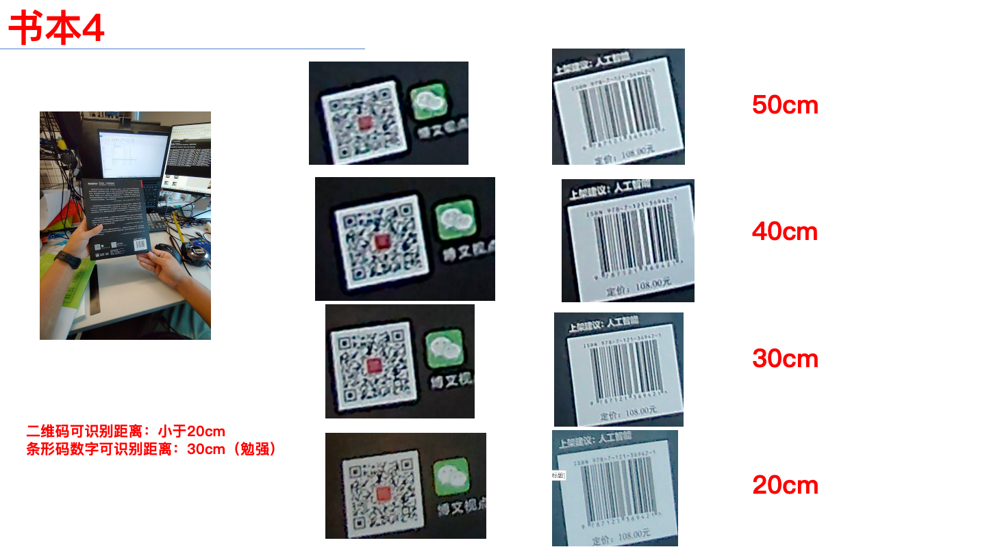
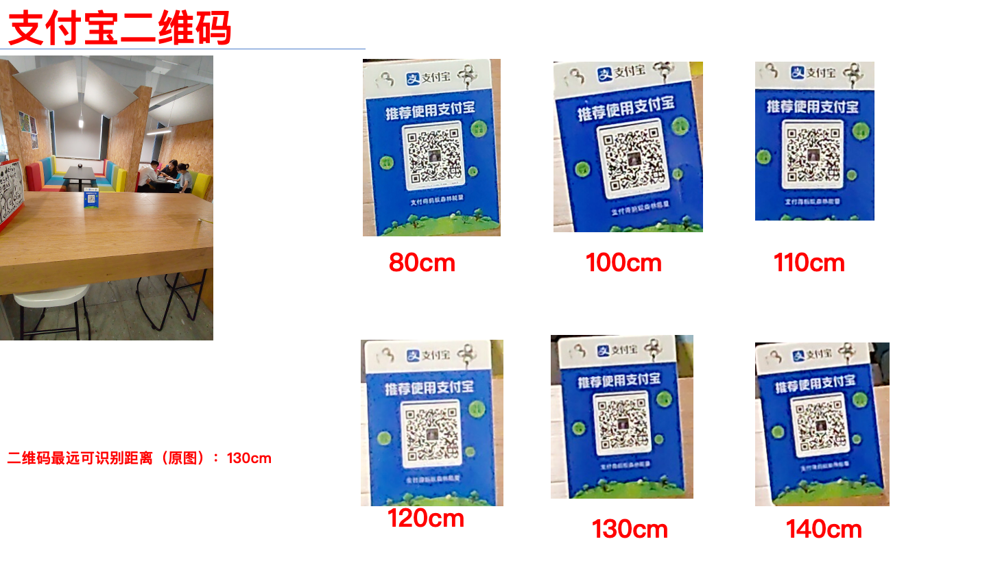
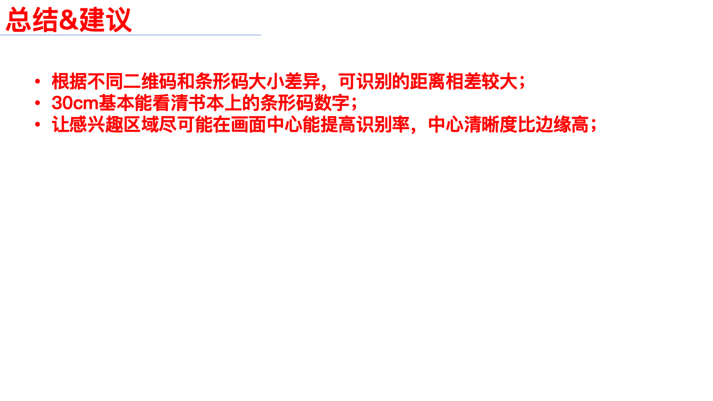

### 眼镜有震动模块或地磁传感器吗？

没有震动模块，也没有地磁传感器。

### 当前麦克风是单麦还是双麦？

双麦克风。

### Vivo 设备硬解码h264个别机型失败如何处理

同一视频流，OPPO / 小米等手机能解码，说明流格式没问题，问题基本在 Vivo 设备的解码器兼容性，默认不在开启硬解码，默认会返回h264编码后的视频流，可以进行软解码。

## 4. 消息与文件传输

### 文件发送前需要放在哪里？

眼镜端发送文件时，建议将文件放在公共存储目录下，避免私有目录权限导致发送失败。

### 眼镜端收到文件保存在哪里？

默认路径：

```text
/storage/emulated/0/Download/receiver/
```

### 手机端收到文件保存在哪里？

默认路径：

```text
/sdcard/Android/data/<应用包名>/files/receiver/
```

### 蓝牙和 P2P 传输怎么选？

- 小消息、小文件、控制指令：可以走蓝牙。
- 大文件、图片、视频、实时流：优先走 P2P。

蓝牙实际吞吐较低，不建议传输大文件。P2P 建立后速度和稳定性更适合媒体和大文件场景。

### 一个手机 App 可以连接眼镜端多个 App 吗？

可以。手机端发送消息时通过目标 `clientId` 区分不同眼镜端应用。

## 5. 媒体与语音

### 系统拍照和录像文件能通过 SDK 拿到吗？

可以。手机与眼镜建立连接后，眼镜端系统拍照和录像文件会同步到手机端：

```text
/sdcard/Android/data/<应用包名>/files/receiver/
```

眼镜端常见系统相册路径：

```text
/storage/emulated/0/DCIM/album/
/storage/emulated/0/Pictures/
```

### 眼镜端拍照或录像文件会自动删除吗？

P2P 连接成功并上传到手机端后，眼镜端图片可能会被系统自动清理，建议业务侧以手机端接收结果为准。

### 默认视频流分辨率和帧率是多少？

- 分辨率：1080P（1080×1920）
- 帧率：约 15–19 fps
- 手机播放端延迟：约 300 ms

### SDK 输出的视频流是什么格式？

支持 H.264 或解码后的 NV21。实际格式以调用接口和 Demo 示例为准。

### 如何使用视频监控功能？

视频监控需要先在灵眸 AR 企业平台获取设备国标信息，再在视频监控页面填写推流参数。

1. 登录灵眸 AR 企业平台：

   [https://ar-center.rokid.com/login](https://ar-center.rokid.com/login)

2. 进入设备管理，查看设备的国标信息。国标信息即设备编号。

   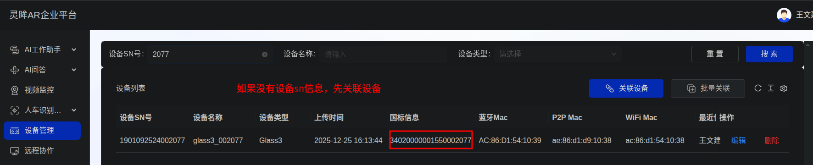

   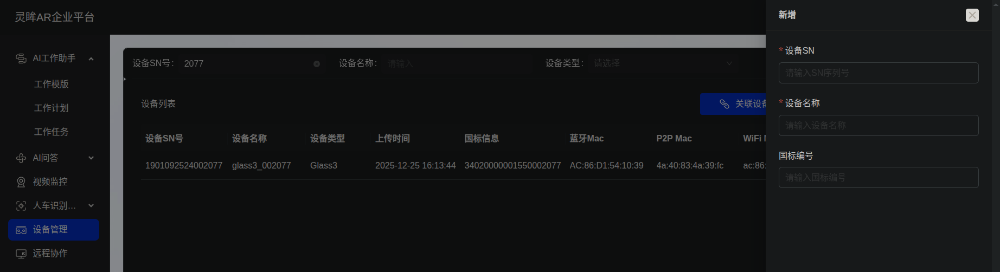

3. 在视频监控页面填写推流信息。

   | 参数 | 示例 |
   | --- | --- |
   | 设备编号 | `34020000001550002077` |
   | 密码 | 可不填写 |
   | 服务域 | `3402000000` |
   | 服务 IP | `8.136.53.153` |
   | 服务端口号 | `15060` |
   | 服务 ID | `34020000002000000001` |

   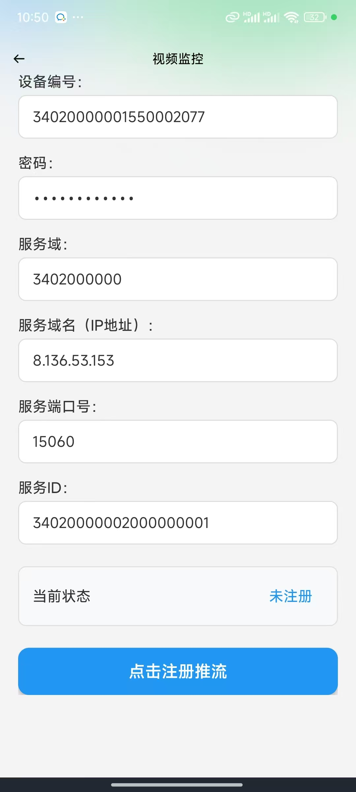

4. 点击推流按钮后，可在后台查看眼镜推流信息。

   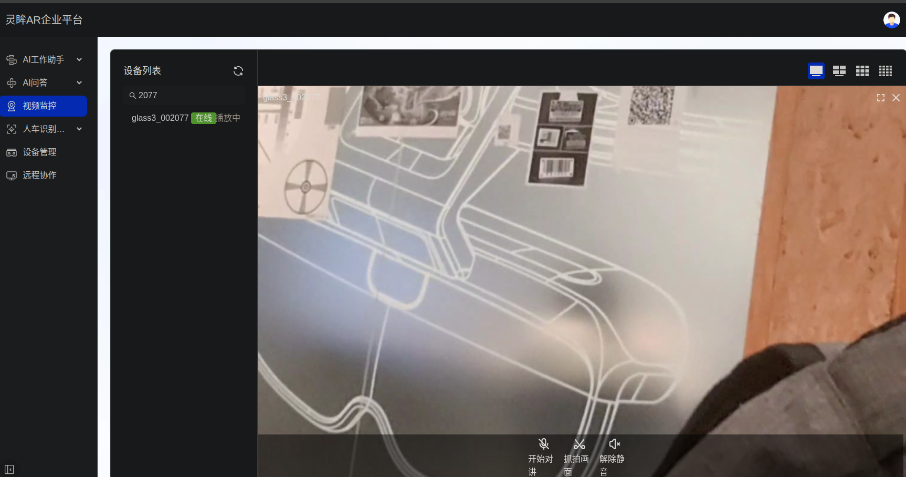

5. 如果需要验证 RTSP 视频流，可以使用线上环境地址格式：

   ```text
   rtsp://ar-security-media.rokid.com:5540/rtp/34020000001550000668_34020000001550000668
   ```

   其中 `ar-security-media.rokid.com` 为线上 RTSP 服务地址，`5540` 为线上 RTSP 服务端口，路径中的国标编号请替换为实际设备国标编号。设备在线时，可以直接使用 RTSP 地址拉起眼镜端推流。

### 录像和在线 ASR 会抢麦克风吗？

使用 SDK 提供的方法时，底层会做音频流分发，一般不会出现麦克风冲突。

### SDK 支持离线 TTS 吗？

支持。请将 SDK 升级到 2.2.0 或更高版本。

### SDK 支持离线 ASR 吗？

暂不支持离线 ASR。开放式语音转文本请使用在线 ASR 或私有化 ASR/TTS 服务。

### 眼镜片上所有的画面全部都可以隐藏掉？

可以的，布局背景设置为黑色，镜片则没有任何画面和颜色。

```xml
<?xml version="1.0" encoding="utf-8"?>
<androidx.constraintlayout.widget.ConstraintLayout xmlns:android="http://schemas.android.com/apk/res/android"
    android:layout_width="match_parent"
    android:layout_height="match_parent"
    android:background="@color/black">

</androidx.constraintlayout.widget.ConstraintLayout>
```

### 人脸检测中一帧画面最多能检测出多少人脸？

最多同时5个，人脸的尺寸在相机中有效尺寸在50x50像素以上，但是不一定是在一次回调中一次性回调完，过程中的产生的帧画面和人脸，默认不保存到磁盘 。现在我们的算法对正对角度的识别比较好，人脸角度大一些(30度以上)的检测速度就会比较慢，容易造成漏检。

### 拍照支持变焦？

拍照不支持数字变焦，摄像头是定焦的，视频支持数字变焦。

## 6. 业务配置

### 如何同步车辆库到眼镜？

1. 登录灵眸 AR 企业平台。
2. 进入人车识别，创建或导入车辆库，并绑定对应眼镜。
3. 手机端连接眼镜后会自动同步一次。
4. 也可以在应用首页进入车辆管理，手动上传布控包到眼镜端。

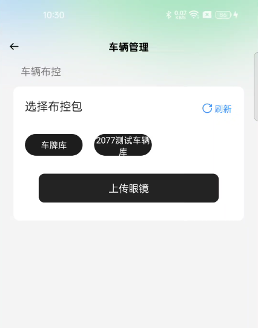

### 如何修改 AI 问答或 AI 工作助手提示词？

1. 登录灵眸 AR 企业平台。
2. 进入应用配置，选择行业应用。
3. 新增或修改行业应用，并绑定眼镜对应使用人。

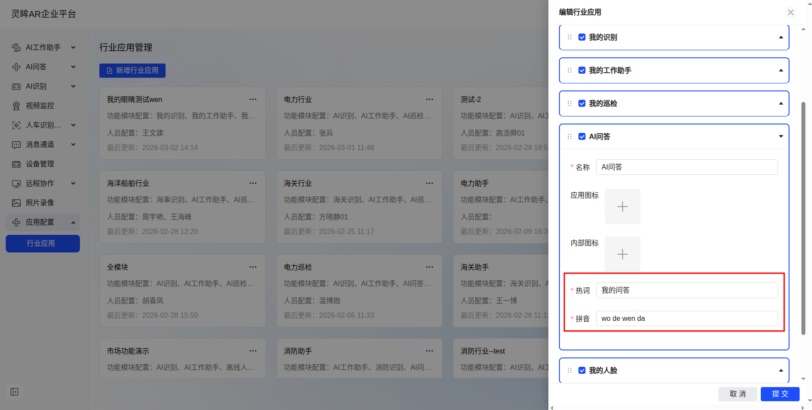

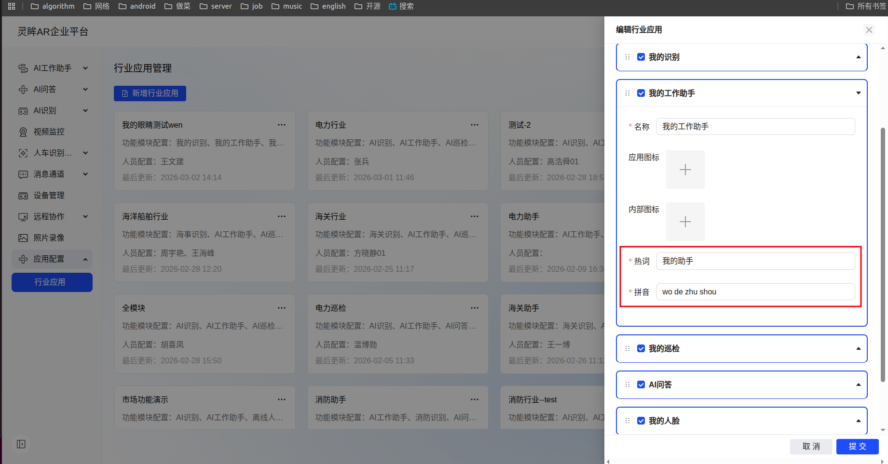

### 如何通过扫码让眼镜联网？

可使用眼镜端扫一扫应用扫描 Wi-Fi 二维码进行联网：

[Wi-Fi 二维码生成工具](https://glassar.rokid.com/userguide/rokid-glass/wifi)

### 眼镜端是可以直接能请求网络吗？

1. 眼镜端连接 Wi-Fi 后，可以直接通过网络进行数据发送。
2. 眼镜端连接手机蓝牙后，可以通过手机端蓝牙通道发送数据；也可以在眼镜端与手机端建立 P2P 连接后，通过 P2P 通道进行数据传输。

### 内置离线人脸 App 是在眼镜端本地完成人脸识别？

人脸照片可以先在灵眸平台中添加，平台会生成人脸库，眼镜端会自动拉取该人脸库。如果眼镜本地已经存在离线人脸库，进入离线人脸识别后，可直接在本地完成识别，不依赖网络。

## 7. 功能使用

### AI 工作助手怎么进入任务工单选择界面？

当前 AI 工作助手无法手动选择工单。报告格式由大模型根据配置和上下文生成，具体使用方式可先参考产品使用手册。

### 扫描产品上的条形码有什么注意事项？

条形码识别对线条宽度、线条间距和画面清晰度比较敏感。如果拍摄距离、角度或对焦状态不稳定，可能出现识别失败或识别错误。

建议：

- 保持条形码在画面中清晰、完整。
- 避免强反光、模糊和过远距离。
- 对需要高频扫码的工业场景，建议配合蓝牙指环使用，操作效率和稳定性会更好。

### 人脸库如何下发到眼睛端

用户可先在灵眸平台上传人脸图片，平台会基于上传的人脸图片自动创建人脸库。AR 眼镜端可通过扫码方式连接 Wi-Fi 网络，网络连接成功后，进入离线人脸应用，系统会将生成的人脸库同步下发至眼镜端，用于后续的人脸识别功能。

### 车牌识别功能如何做？

开发一个自己的眼睛端应用，接入sdk的车牌检测功能，在得到车牌之后，车牌信息传给服务器端进行业务处理后，把结果返回给眼镜端。

## 8. 其他问题

### uni-app 可以接入 Glass3 SDK 吗？

可以，但需要自行实现 uni-app 与 Android 原生 SDK 的桥接。Glass3 SDK 本身提供 Android 原生能力，不直接提供 uni-app 插件。那能用uni-app来替代的话，可以运行在ios 鸿蒙手机上吗？不能运行在iOS 或者鸿蒙手机上。

### 指环中间按键能否拦截？

指环中间按键长按会触发 `KEY_POWER`，该操作由系统处理，用于亮屏/灭屏，应用层无法拦截。

### 如何查看系统内存？

可通过 ADB 查看：

```bash
adb shell cat /proc/meminfo
adb shell dumpsys meminfo
```

当系统可用内存长期低于约 320 MB 时，后台进程更容易被系统清理。建议在性能问题排查时同时关注 CPU 温度、可用内存和业务进程内存占用。

### Rokid AI企业版的app如何反馈问题

方法一：进入Rokid AI企业版APP首页后，先连接上眼镜端的蓝牙 ，然后点击首页的设置按钮，点击日志上传，并发送眼镜端SN号给我们即可。

方法二：导出手机端`/sdcard/Android/data/com.rokid.security.phone.sdk.demo/files/Documents/mobileLog`目录下的所有日志文件，

导出眼镜端`/sdcard/Download/glass3Log` `目录下的所有日志文件，然后发送给我们。

#### 错装到眼镜中的app怎么删除

```bash
adb shell pm list packages | grep 关键词
adb uninstall 包名
```
