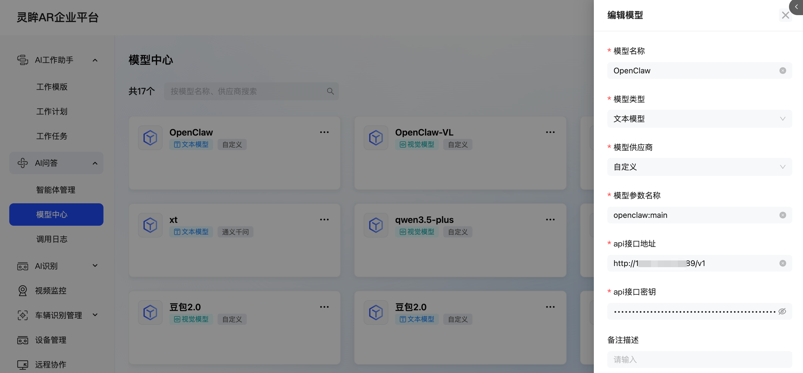
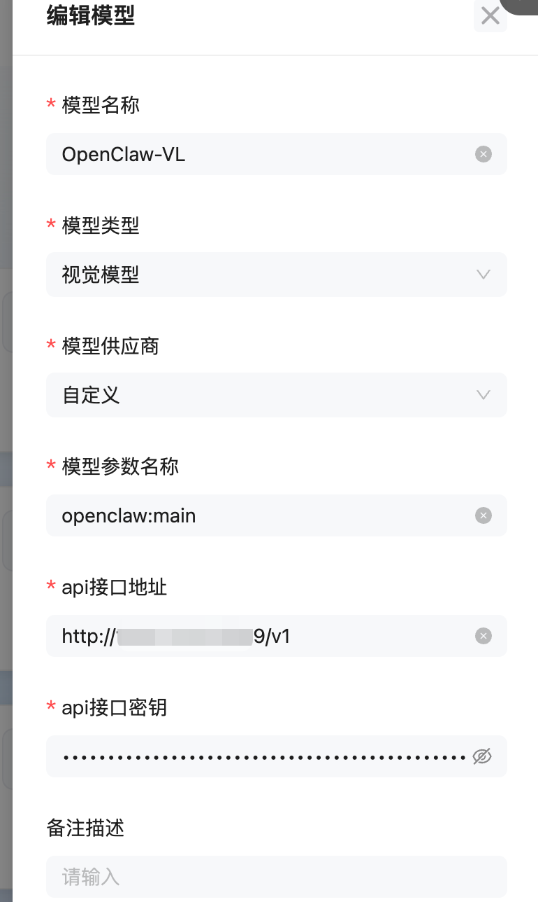
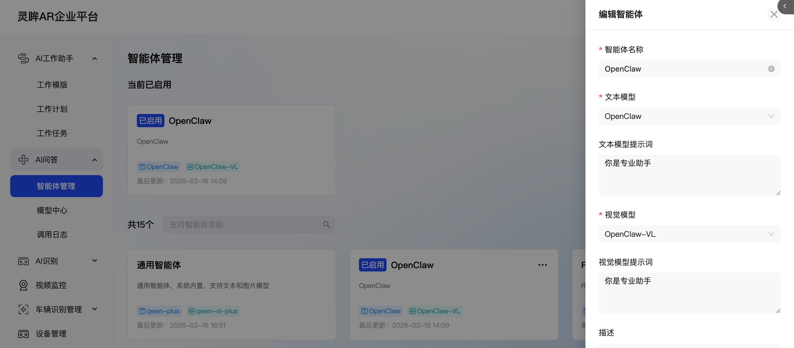

# Glass3接入OpenClaw

## 配置OpenClaw

要使用 OpenAI 兼容的 `curl` 访问 **OpenClaw Gateway**，首先需要明确一点：OpenClaw 的 HTTP REST 适配器（`/v1/chat/completions`）在默认情况下是**禁用**的。

你需要先开启该功能，然后才能使用标准的 OpenAI 格式指令。

### 1. 开启 OpenAI 兼容端点

在你的 macOS 上打开 `~/.openclaw/openclaw.json`，确保 `gateway` 配置包含以下内容：

```json
{
  "gateway": {
    "http": {
      "endpoints": {
        "chatCompletions": {
          "enabled": true
        }
      }
    },
    "auth": {
      "token": "你的GATEWAY_TOKEN"
    }
  }
}

```

_或者直接通过 CLI 开启：_

```bash
openclaw config set gateway.http.endpoints.chatCompletions.enabled true
openclaw gateway restart
```
### 2. 标准 OpenAI 兼容 curl

开启后，你可以像调用 OpenAI 一样调用它。注意 `model` 参数通常对应你 OpenClaw 中的 **Agent ID**（例如 `openclaw:main`）。

```bash
curl -X POST http://<你的局域网IP>:18789/v1/chat/completions \
     -H "Authorization: Bearer 你的GATEWAY_TOKEN" \
     -H "Content-Type: application/json" \
     -d '{
       "model": "openclaw:main",
       "messages": [
         {
           "role": "system",
           "content": "你是一个运行在 Rokid 设备上的 AI 助手。"
         },
         {
           "role": "user",
           "content": "检查当前 rokidspace 项目的状态"
         }
       ],
       "stream": false
     }'

```

### 3. 流式响应 (Streaming)

如果你需要流式输出（即打字机效果），只需将 `stream` 设为 `true`：

```bash
curl -X POST http://<你的局域网IP>:18789/v1/chat/completions \
     -H "Authorization: Bearer 你的GATEWAY_TOKEN" \
     -H "Content-Type: application/json" \
     -d '{
       "model": "openclaw:main",
       "messages": [{"role": "user", "content": "你好"}],
       "stream": true
     }'

```

## 接入灵眸云平台

1. 云平台地址：[https://x-inspection.rokid.com/](https://x-inspection.rokid.com/)

2. 配置模型中心，新增openClaw和openClawVL，除了类型不一样，其他配置一样

   

   

   

3. 新增智能体OpenClaw，提示词可以忽略，选择对应的模型，并启用。



## Glass3企业版使用

恭喜你，配置完成！在眼镜端使用AI问答就可以直接和OpenClaw对话了！