# 国标/RTSP 推流接入

本页说明如何在灵眸平台完成 Glass3 设备的国标平台关联、在线推流，以及如何通过 RTSP 地址验证视频流。接入前，请先确保目标设备已经完成平台注册，并具备可用的网络连接。

> 页面截图仅用于说明操作路径。平台入口、字段名称和样式可能随版本调整，请以实际页面为准。

## 适用场景

安防、巡检、应急指挥等业务中，经常需要将一线人员佩戴的 Glass3 眼镜画面接入视频监控平台，便于后台实时查看现场情况、统一调度资源，或将现场画面接入已有的监控大屏和录像系统。国标/RTSP 推流适合用于这类需要标准视频流接入的场景。

- 将 Glass3 眼镜视频流接入企业已有的视频监控平台。
- 通过国标平台查看、调度或管理眼镜端实时画面。
- 在安防巡检、远程值守、应急处理或现场执法场景中查看第一视角画面。
- 获取 RTSP 地址后，在本地播放器、视频网关或业务系统中验证和消费视频流。

## 接入前准备

- 设备已经在灵眸平台完成注册，并处于可用状态。
- 已准备国标或 RTSP 接入所需的平台信息，例如平台地址、端口、设备编号、通道编号、注册密码等。
- 眼镜所在网络可以访问目标视频平台，播放器或业务系统也可以访问 RTSP 地址。

## 1. 关联设备到国标平台

进入灵眸平台的设备管理页面，找到需要测试的眼镜设备，点击设备操作入口，进入设备关联或编辑页面。

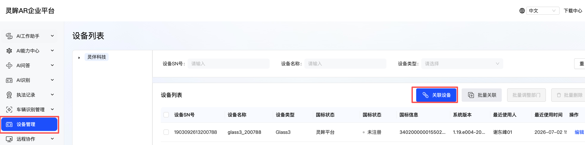

在国标平台配置中选择目标平台。测试灵眸平台能力时，可以选择平台内置的国标平台；如果接入第三方平台，请选择已完成配置的平台，并按项目要求填写对应参数。

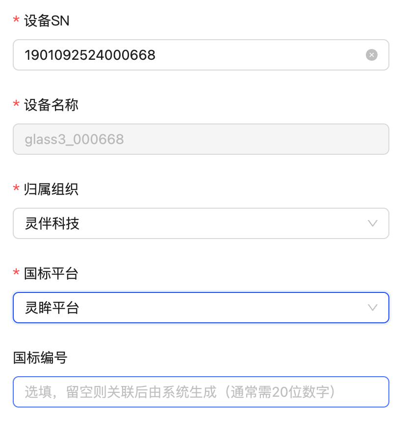

保存后，设备会关联到所选平台。

## 2. 同步眼镜端账号信息

打开眼镜端的“扫一扫”应用，扫描平台页面右上角的登录二维码。扫码成功后，眼镜会提示账号授权成功。

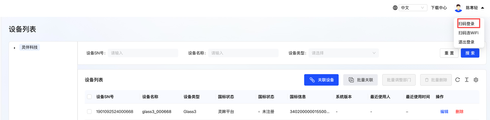

刷新设备页面后，可以看到设备已经同步出账号相关数据。

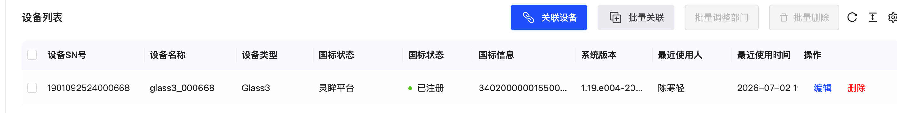

## 3. 获取设备国标编号

再次进入设备编辑页面，查看系统生成的国标编号。后续推流和 RTSP 地址验证都会用到该编号。

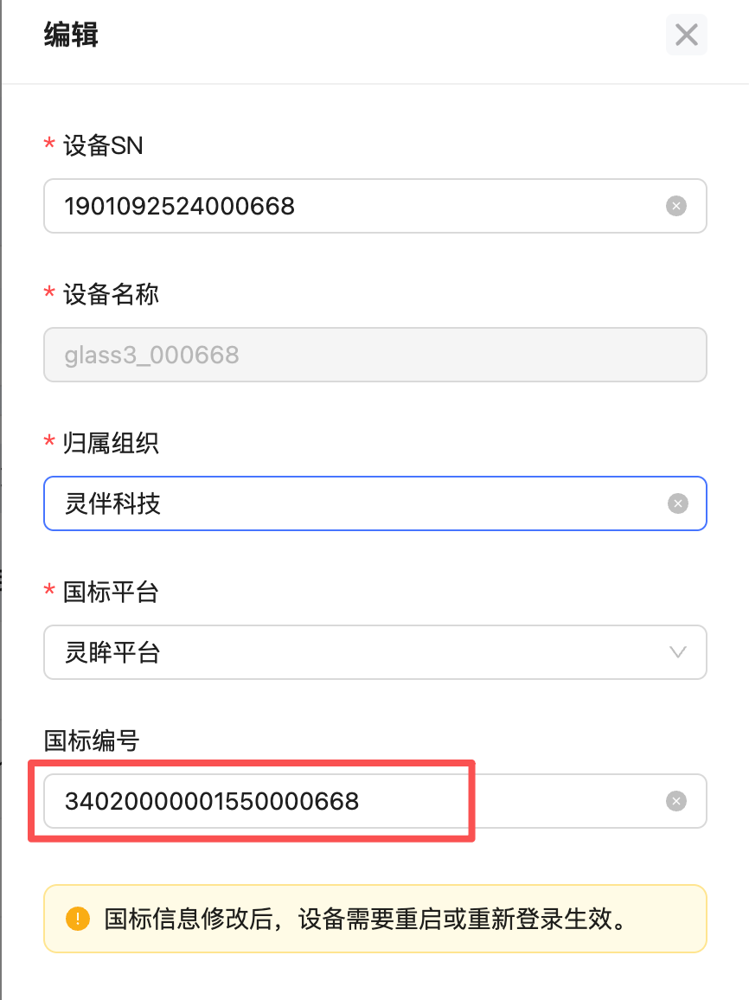

> 建议在联调记录中保存设备 SN、国标编号、平台名称和测试时间，便于后续排查设备注册或推流问题。

## 4. 确认设备在线并拉起推流

进入执法记录下的灵眸监控页面，输入设备 SN 查询目标设备，并确认设备状态为“在线”。

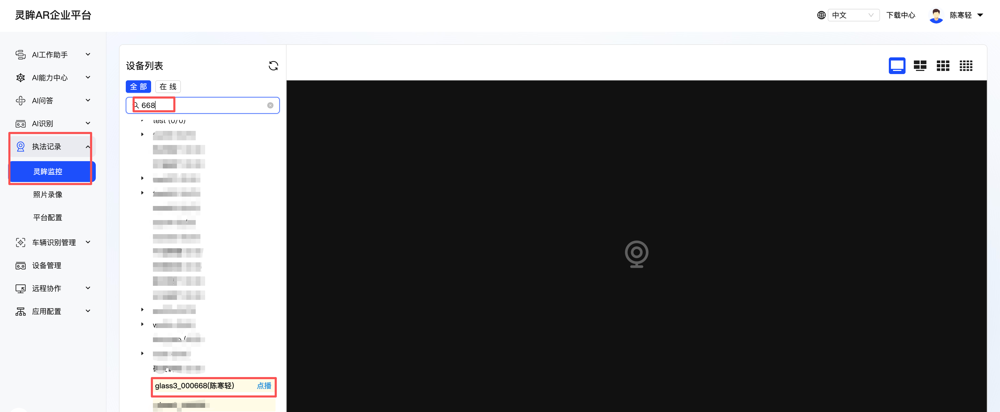

设备在线后，可以直接使用 RTSP 地址拉起眼镜端推流，无需先点击“点播”。页面显示播放画面后，说明国标推流链路已经可用。

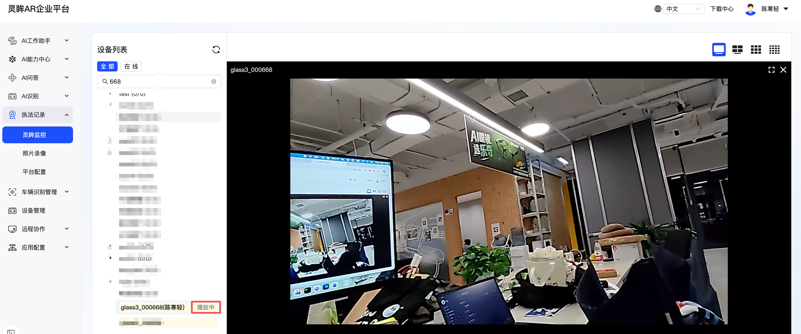

> 设备在线时，RTSP 地址即可直接拉起眼镜端推流。如果播放器无法打开 RTSP 地址，请先确认设备状态为“在线”，并检查 RTSP 地址、网络和播放器配置。

## 5. 生成 RTSP 流地址

RTSP 地址格式以项目实际配置为准。常见测试格式如下：

```text
rtsp://<RTSP_HOST>:<RTSP_PORT>/rtp/<国标编号>_<国标编号>
```

线上环境示例：

```text
rtsp://ar-security-media.rokid.com:5540/rtp/34020000001550000668_34020000001550000668
```

其中：

- `<RTSP_HOST>`：RTSP 服务地址，线上环境示例为 `ar-security-media.rokid.com`。
- `<RTSP_PORT>`：RTSP 服务端口，线上环境示例为 `5540`。
- `<国标编号>`：设备编辑页中生成或配置的国标编号。

## 6. 验证 RTSP 流

拿到 RTSP 地址后，可以使用支持 RTSP 的播放器或命令行工具验证视频流。下面以 macOS 上的 IINA、`ffplay` 和 Windows 上的 PotPlayer 为例。

### macOS：使用 IINA 验证

打开 [IINA](https://iina.io/) 后，选择“打开 URL”。

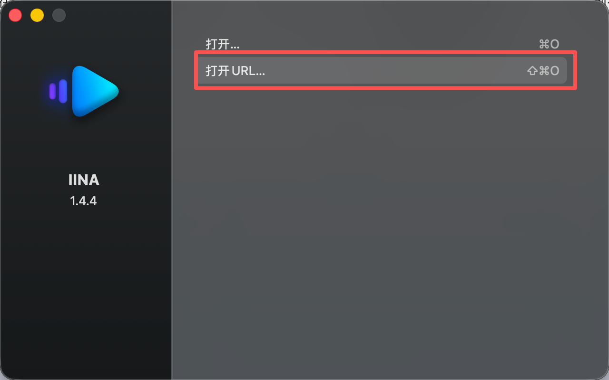

粘贴 RTSP 地址。

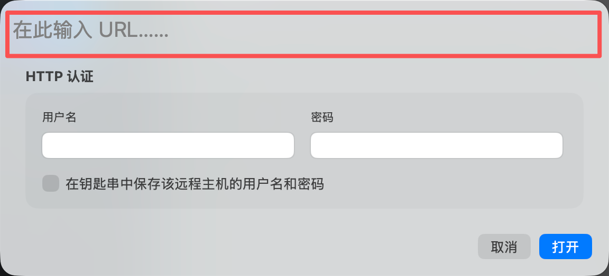

确认打开。

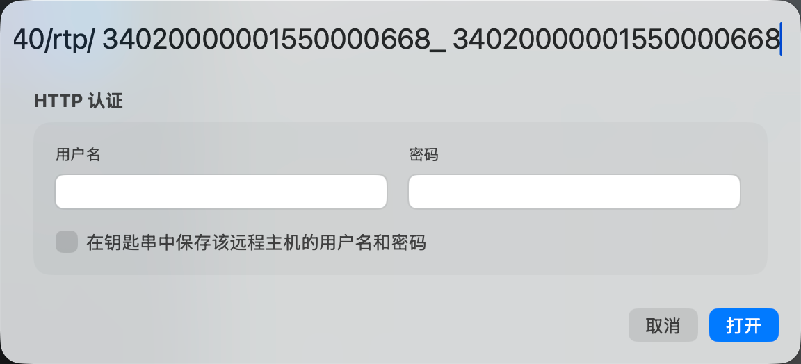

如果播放器中出现眼镜端实时画面，说明 RTSP 推流验证成功。

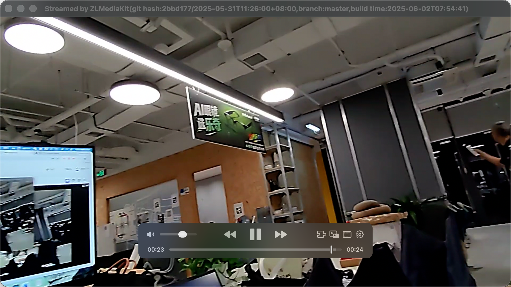

也可以使用 `ffplay` 命令验证：

```bash
ffplay "rtsp://ar-security-media.rokid.com:5540/rtp/34020000001550000668_34020000001550000668"
```


### Windows：使用 PotPlayer 验证

打开 PotPlayer，右键选择“打开”，再选择“打开链接”。

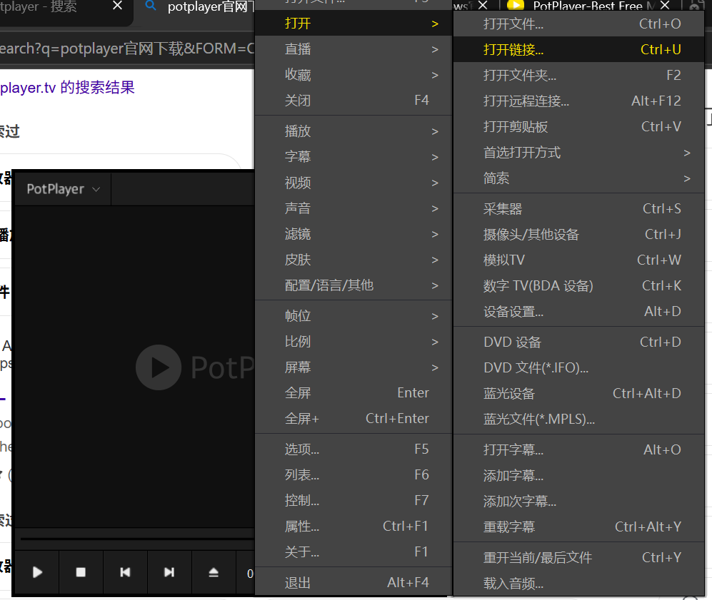

输入 RTSP 地址后点击确认。

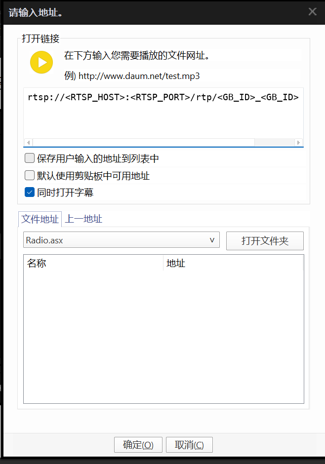

如果播放器中出现眼镜端实时画面，说明 RTSP 推流验证成功。

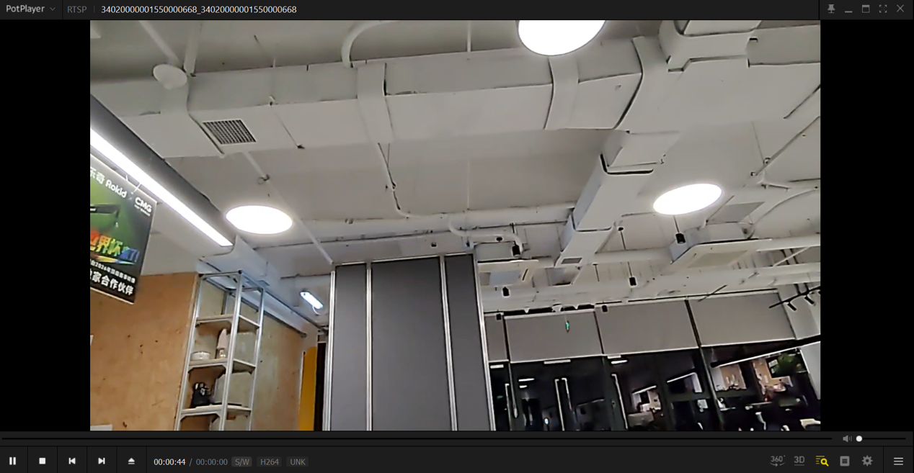

## 后续集成方向

确认 RTSP 流可以稳定播放后，开发者可以根据业务需要继续完成平台侧集成：

- **接入视频监控平台**：将 RTSP 地址接入企业已有的视频平台、NVR、视频网关或监控大屏。
- **实时预览与调度**：在调度台、指挥中心或巡检系统中展示一线人员第一视角画面。
- **录像与留档**：在平台侧按业务规则录制视频流，用于复盘、取证或质量检查。
- **AI 分析与告警**：将视频流接入视觉识别、工单系统或告警流程，辅助安全巡检和异常发现。
- **多端分发**：根据网络和权限要求，将视频流转发给 Web 端、桌面端或移动端业务应用。

## 常见问题

| 现象 | 建议排查 |
| --- | --- |
| 无法拉起设备推流 | 确认设备已关联到正确平台且处于在线状态，眼镜网络可以访问目标视频平台。 |
| 页面中没有使用人或系统信息 | 使用眼镜端“扫一扫”应用扫描平台登录二维码，授权成功后刷新页面。 |
| 找不到国标编号 | 进入设备编辑页面查看系统生成或配置的国标编号。 |
| RTSP 地址无法播放 | 确认设备处于在线状态，再检查 RTSP 地址格式、国标编号、服务地址和端口是否正确。 |
| 播放器连接超时 | 确认播放器所在电脑可以访问 RTSP 服务地址和端口，网络策略或防火墙没有拦截。 |
| 画面卡顿或延迟较高 | 检查眼镜端网络质量、平台转发链路和播放器所在网络环境。 |

## 相关资料

- [常见问题：视频监控如何接入国标平台](/faq/常见问题.md#_23-视频监控如何接入国标平台)
