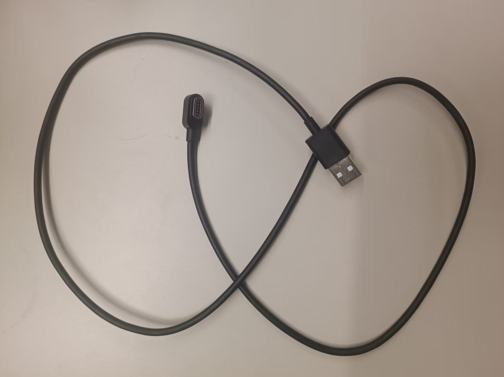
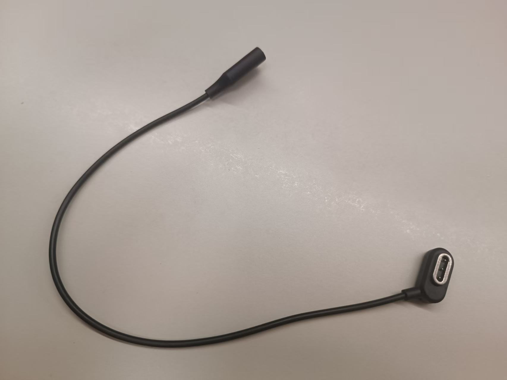

# Glass3 SDK 快速开始

本页帮助你完成 Glass3 SDK 的开发环境准备，以及手机端和眼镜端 SDK 的基础集成。

## 你将完成什么

完成本页后，你应该可以：

- 确认眼镜调试线、投屏工具和开发环境。
- 为手机端和眼镜端应用添加 SDK 依赖。
- 知道后续应该阅读 Demo 运行指南、代码示例、API 参考和眼镜端设计规范。

如果你希望先看视频演示，可以在 [视频教程](./视频教程.md#_1-五分钟快速构建应用) 中查看“五分钟快速构建应用”。正式接入时，建议优先按本文步骤操作。

如果你想先跑通官方 Demo，请查看 [Demo 运行指南](/downloads/demo-guide.md)。本文下面主要说明如何在自己的 Android 工程中配置 Maven 仓库并接入 SDK 依赖。

如果你需要开发眼镜端页面，建议在开始写 UI 前先阅读 [眼镜端设计规范](../capabilities/设计规范.md)，了解 Glass3 显示区域、布局、安全距离和视觉呈现建议。

## 1. 先确认线材和投屏工具

在运行眼镜端 Demo 前，请先确认你手上的是 **Glass3 数据调试线**，不是普通充电线。很多调试失败都来自线材用错：充电线只能充电，不能让 Android Studio 识别眼镜设备。

| 物品 | 用途 | 是否必须 |
| --- | --- | --- |
| Glass3 数据调试线 | 连接眼镜和电脑，让 Android Studio 识别眼镜并安装眼镜端 Demo。 | 必须 |
| Glass3 充电线 | 给眼镜充电。不能用于 Android Studio 调试。 | 按需 |
| [投屏工具](../resources/有线无线投屏.md) | 将眼镜画面投到电脑上，便于确认安装、运行和 UI 状态。 | 强烈建议 |

### 1.1 Glass3 数据调试线

调试线用于让 Android Studio 识别眼镜设备。运行眼镜端 Demo、查看设备日志、安装 APK 时都需要它。



连接后，可以在 Android Studio 的设备列表中看到类似 `Rokid RG-glasses` 的设备。如果没有识别到设备，请优先检查是否使用了数据调试线。

### 1.2 Glass3 充电线

充电线只用于充电，不能作为眼镜端 Demo 的调试连接线。



如果你只能给眼镜充电，但 Android Studio 看不到设备，通常说明当前线材不是数据调试线。

### 1.3 了解投屏工具

建议使用 [投屏工具](../resources/有线无线投屏.md) 将眼镜画面投到电脑上，便于确认眼镜端 Demo 是否启动、页面是否显示、交互是否生效。

如果你需要了解下载、安装和使用方式，请查看 [投屏工具](../resources/有线无线投屏.md)。

## 2. 准备开发环境

### 2.1 开发环境

| 项目 | 要求 |
| --- | --- |
| Android Studio | 建议使用 2022 或更高版本 |
| JDK | 17 或更高版本 |
| Android 系统 | Glass3 SDK 支持 Android 8.0 及以上版本 |
| 设备 | Rokid Glass3 眼镜 + Android 手机 |

## 3. 配置 Maven 仓库

在工程中加入 Rokid Maven 仓库。

Gradle 7.0 及以上版本，推荐在 `settings.gradle` 中配置：

```groovy
dependencyResolutionManagement {
    repositories {
        google()
        mavenCentral()
        maven { url 'https://maven.rokid.com/repository/maven-public/' }
    }
}
```

Gradle 7.0 以下版本，可在根目录 `build.gradle` 中配置：

```groovy
buildscript {
    repositories {
        google()
        mavenCentral()
        maven { url 'https://maven.rokid.com/repository/maven-public/' }
    }
}
```

## 4. 集成 SDK 依赖

<a id="quickstart-glass-sdk-dependency"></a>

### 4.1 眼镜端 SDK

在眼镜端应用模块的 `build.gradle` 中添加：

```groovy
dependencies {
    implementation ('com.rokid.security:glass3.open.sdk:2.2.0-E') {
        exclude group: "org.slf4j"
    }
}
```

如果遇到 native 库冲突，在 `android` 配置中添加：

```groovy
android {
    packagingOptions {
        pickFirst 'lib/arm64-v8a/libr2aud.so'
        pickFirst 'lib/armeabi-v7a/libr2aud.so'
    }
}
```

<a id="quickstart-phone-sdk-dependency"></a>

### 4.2 手机端 SDK

在手机端应用模块的 `build.gradle` 中添加：

```groovy
dependencies {
    implementation ('com.rokid.security:phone.sdk:2.2.0-E') {
        exclude group: "org.slf4j"
    }
}
```

## 5. 权限配置

根据实际业务能力，在 `app/src/main/AndroidManifest.xml` 中声明权限。

### 5.1 手机端常用权限

```xml
<!-- 基础能力 -->
<uses-permission android:name="android.permission.INTERNET" />
<uses-permission android:name="android.permission.ACCESS_NETWORK_STATE" />
<uses-permission android:name="android.permission.ACCESS_WIFI_STATE" />
<uses-permission android:name="android.permission.CHANGE_WIFI_STATE" />
<uses-permission android:name="android.permission.CHANGE_NETWORK_STATE" />

<!-- 媒体能力 -->
<uses-permission android:name="android.permission.CAMERA" />
<uses-permission android:name="android.permission.RECORD_AUDIO" />
<uses-permission android:name="android.permission.VIBRATE" />

<!-- 存储能力 -->
<uses-permission android:name="android.permission.READ_EXTERNAL_STORAGE" />
<uses-permission android:name="android.permission.WRITE_EXTERNAL_STORAGE" />

<!-- Android 12 以下蓝牙权限 -->
<uses-permission android:name="android.permission.BLUETOOTH" />
<uses-permission android:name="android.permission.BLUETOOTH_ADMIN" />

<!-- Android 12 及以上蓝牙权限 -->
<uses-permission
    android:name="android.permission.BLUETOOTH_SCAN"
    android:usesPermissionFlags="neverForLocation" />
<uses-permission android:name="android.permission.BLUETOOTH_CONNECT" />
<uses-permission android:name="android.permission.BLUETOOTH_ADVERTISE" />

<!-- 定位与 Wi-Fi P2P -->
<uses-permission android:name="android.permission.ACCESS_COARSE_LOCATION" />
<uses-permission android:name="android.permission.ACCESS_FINE_LOCATION" />
<uses-permission
    android:name="android.permission.NEARBY_WIFI_DEVICES"
    android:usesPermissionFlags="neverForLocation" />

<uses-feature
    android:name="android.hardware.wifi.direct"
    android:required="false" />
<uses-feature
    android:name="android.hardware.camera"
    android:required="false" />
```

Android 6.0 及以上版本，危险权限通常还需要动态申请，不能只依赖 `AndroidManifest.xml` 静态声明。

### 5.2 眼镜端常用权限

```xml
<!-- 基础能力 -->
<uses-permission android:name="android.permission.INTERNET" />
<uses-permission android:name="android.permission.ACCESS_NETWORK_STATE" />
<uses-permission android:name="android.permission.ACCESS_WIFI_STATE" />
<uses-permission android:name="android.permission.CHANGE_WIFI_STATE" />
<uses-permission android:name="android.permission.CHANGE_NETWORK_STATE" />

<!-- 媒体能力 -->
<uses-permission android:name="android.permission.CAMERA" />
<uses-permission android:name="android.permission.RECORD_AUDIO" />
<uses-permission android:name="android.permission.VIBRATE" />

<!-- 存储能力 -->
<uses-permission android:name="android.permission.READ_EXTERNAL_STORAGE" />
<uses-permission android:name="android.permission.WRITE_EXTERNAL_STORAGE" />
<uses-permission
    android:name="android.permission.MANAGE_EXTERNAL_STORAGE"
    tools:ignore="AllFilesAccessPolicy,ScopedStorage" />

<!-- 蓝牙能力 -->
<uses-permission android:name="android.permission.BLUETOOTH" />
<uses-permission android:name="android.permission.BLUETOOTH_ADMIN" />
<uses-permission
    android:name="android.permission.BLUETOOTH_SCAN"
    android:usesPermissionFlags="neverForLocation"
    tools:targetApi="31" />
<uses-permission android:name="android.permission.BLUETOOTH_CONNECT" />
<uses-permission android:name="android.permission.BLUETOOTH_ADVERTISE" />

<!-- 定位与 Wi-Fi P2P -->
<uses-permission android:name="android.permission.ACCESS_COARSE_LOCATION" />
<uses-permission android:name="android.permission.ACCESS_FINE_LOCATION" />
<uses-permission
    android:name="android.permission.NEARBY_WIFI_DEVICES"
    android:usesPermissionFlags="neverForLocation"
    tools:targetApi="31" />

<uses-feature
    android:name="android.hardware.wifi.direct"
    android:required="false" />
<uses-feature
    android:name="android.hardware.camera"
    android:required="false" />
```

## 6. 一行代码确认 SDK 状态

完成依赖、权限和初始化代码后，可以在对应端侧打印 SDK 状态，确认 SDK 是否已经处于可用状态。

眼镜端：

```kotlin
Log.d("SDK_CHECK", "glass sdk ready = ${GlassSdk.isReady()}")
```

手机端：

```kotlin
Log.d("SDK_CHECK", "phone sdk initialized = ${PSecuritySDK.getMobileEngineService().isInit()}")
```

如果日志输出为 `true`，说明对应端侧 SDK 已完成初始化或处于可用状态。如果输出为 `false`，请回到初始化代码检查，或参考 [Demo 运行指南](/downloads/demo-guide.md) 和 [API 参考](/terminal-sdk/api-reference/)。

## 7. 下一步

- 想完整跑通 Demo：阅读 [Demo 运行指南](/downloads/demo-guide.md)。
- 想按功能接入：阅读 [代码示例](/downloads/samples.md)。
- 想开发眼镜端 UI：阅读 [眼镜端设计规范](../capabilities/设计规范.md)。
- 想查接口定义：阅读 [API 参考](/terminal-sdk/api-reference/)。
- 遇到问题：阅读 [FAQ 总览](/faq/常见问题.md)。
