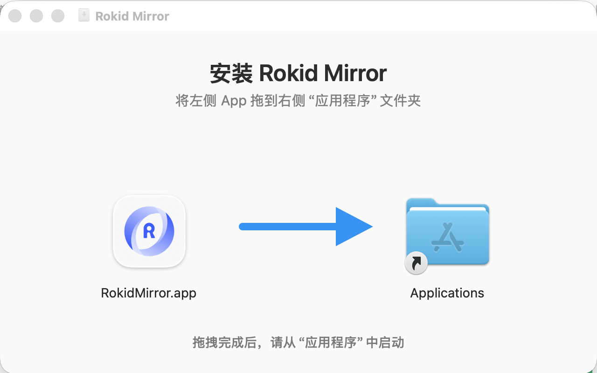
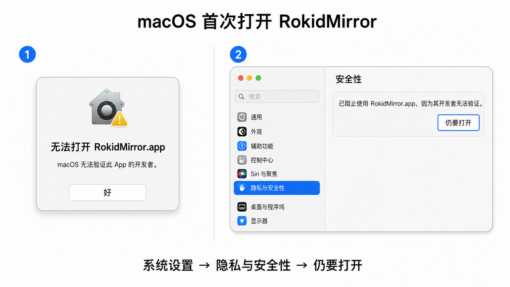

# 无线投屏 RokidMirror

开发 Glass3 眼镜端应用时，可以把眼镜画面投到电脑上，用于调试、演示和问题排查。推荐优先使用 **RokidMirror 无线投屏工具**配合企业版系统内置的**扫一扫**应用。

## RokidMirror 无线投屏

RokidMirror 无线投屏工具适合演示、远程排查和不方便长时间连接数据线的调试场景。工具已内置 [`adb`](./使用手册与常用资料.md#adb-基础说明) 和 `scrcpy` 运行环境。当前 macOS 和 Windows 版本均为 1.1.9，支持通过二维码让眼镜连接目标 Wi-Fi、临时开启无线 ADB，并自动启动投屏。

### 眼镜端应用选择

::: tip 企业版 Glass3 优先使用系统内置扫一扫
当前企业版系统的**扫一扫**应用已经支持扫码投屏。打开系统应用列表中的**扫一扫**，扫描 RokidMirror 显示的二维码即可，无需再安装独立的扫码投屏 APK。
:::

如果企业版眼镜中的扫一扫暂时不能识别投屏二维码，请先检查系统更新并升级到较新的企业版系统。现场暂时无法升级时，可以把下方的独立**扫码投屏**APK作为过渡方案安装使用。

生活版眼镜是否能够开启无线 ADB，还取决于对应系统授权以及手机 **Rokid AI App > 开发者 > 眼镜 ADB 调试**开关。独立 APK 主要用于兼容验证和临时使用，不替代企业版系统内置扫一扫。

### 工具下载

需要一次准备好全部文件时，可以下载包含操作手册、三个桌面安装包和备用扫码投屏 APK 的 1.1.9 完整归档包：

- <a href="/tools/rokid-mirror/RokidMirror-wireless-mirroring-kit-v1.1.9.zip" download><strong>下载 RokidMirror 无线投屏完整包 v1.1.9</strong></a>
- <a href="/tools/rokid-mirror/RokidMirror-wireless-mirroring-guide-v1.1.9.pdf" download>单独下载《RokidMirror 无线投屏操作手册》PDF</a>

也可以按电脑系统和架构分别下载：

| 系统 | 架构 | 版本 | 下载 |
| --- | --- | --- | --- |
| macOS | Apple Silicon / arm64 | 1.1.9 | <a href="/tools/rokid-mirror/RokidMirror-macos-arm64-v1.1.9.dmg" download>RokidMirror-macos-arm64-v1.1.9.dmg</a> |
| macOS | Intel / x86_64 | 1.1.9 | <a href="/tools/rokid-mirror/RokidMirror-macos-x86_64-v1.1.9.dmg" download>RokidMirror-macos-x86_64-v1.1.9.dmg</a> |
| Windows | Windows x64 | 1.1.9 | <a href="/tools/rokid-mirror/RokidMirrorTool-windows-x64-v1.1.9.zip" download>RokidMirrorTool-windows-x64-v1.1.9.zip</a> |
| Glass3 | arm64-v8a | 备用扫码投屏 1.0.7 | <a href="/tools/rokid-mirror/RokidMirrorScan-v1.0.7-system-signed.apk" download>RokidMirrorScan-v1.0.7-system-signed.apk</a> |

桌面工具的功能变化、稳定性优化和兼容性说明请查看：[RokidMirror 版本记录](./RokidMirror版本记录.md)。

### macOS 安装与首次打开

请根据 Mac 处理器下载对应的 DMG。Apple M1/M2/M3/M4 等芯片选择 **Apple Silicon / arm64**，Intel 处理器选择 **Intel / x86_64**。

1. 双击下载的 `.dmg` 文件。
2. 在安装窗口中，将左侧的 `RokidMirror.app` 拖到右侧的**应用程序**文件夹。
3. 等待复制完成，推出 Rokid Mirror 磁盘映像。
4. 从 Finder 的**应用程序**目录启动 RokidMirror。



> 请勿直接从 DMG、下载目录或临时解压目录长期运行应用。安装到 `/Applications` 后，macOS 才能使用稳定的应用路径和身份保存本地网络等隐私授权。

首次启动时，macOS 可能提示“无法打开”或“无法验证开发者”。这不是安装包损坏，而是 Gatekeeper 在拦截尚未经过 Apple 公证或首次从互联网下载的应用。请按以下步骤允许本次打开：

1. 在提示窗口中点击**好**，关闭提示。
2. 打开 **系统设置 > 隐私与安全性**。
3. 向下找到“已阻止使用 `RokidMirror.app`”的提示，点击**仍要打开**。
4. 根据系统提示使用 Touch ID 或登录密码确认，再次点击**打开**。
5. 完成一次确认后，后续通常可以直接启动应用。



> 只应对从本文下载的 RokidMirror 工具执行“仍要打开”。不要绕过系统安全提示来运行来源不明的应用。

首次通过局域网连接眼镜时，macOS 还可能请求“本地网络”权限。请选择**允许**。如果之前拒绝，工具会在失败卡片中显示**打开本地网络设置**，点击后可前往 **系统设置 > 隐私与安全性 > 本地网络**。允许 RokidMirror 后，请完全退出并重新打开工具。

如果“本地网络”列表中暂时没有 RokidMirror，请确认应用已经拖入**应用程序**目录，再完全退出工具并重新打开，让应用实际发起一次局域网连接，然后返回权限页面查看。应用可以打开设置页面，但不能代替用户修改 macOS 隐私权限。

如果此前在工具中勾选过**记住密码**，RokidMirror 会把用户手动填写的网络凭据保存到本应用的 macOS 钥匙串条目，不会读取系统保存的其他 Wi-Fi 密码。首次访问该条目，或应用升级后 macOS 重新确认访问权限时，系统可能要求输入 Mac 登录密码。若希望下次启动时自动恢复该凭据，请选择**始终允许**（部分系统显示“永久允许”）；选择**允许**通常只授权本次访问，后续仍可能再次询问。这个钥匙串弹窗与上面的“本地网络”权限是两项独立授权。

### Windows 解压与启动

下载 Windows ZIP 后：

1. 完整解压到一个本地目录，不能直接在 ZIP 内运行。
2. 打开解压后的 `RokidMirrorTool` 文件夹。
3. 双击 `RokidMirror.exe`。

请保留文件夹内的 `tools` 目录，以及其中的 `adb`、`scrcpy`、DLL、`scrcpy-server` 等依赖文件，不要只单独复制 EXE，也不要在 ZIP 预览窗口中直接启动。建议将整个文件夹放到用户有读写权限的本地目录。

如果 Windows SmartScreen 阻止首次运行，请先确认 ZIP 来自本文下载链接，再按系统提示选择**更多信息 > 仍要运行**。不要对来源不明的程序绕过安全提示。

首次启动或首次接收眼镜回调时，如果出现 Windows Defender 防火墙提示：

1. 勾选**专用网络**，然后点击**允许访问**。
2. 仅在明确受信任且确有需要时开放公用网络，不建议在普通公共 Wi-Fi 中开放。
3. 如果没有弹窗但扫码回调失败，可进入 **Windows 安全中心 > 防火墙和网络保护 > 允许应用通过防火墙**，确认 `RokidMirror.exe` 已允许专用网络访问。
4. 在可信局域网内，建议打开 **设置 > 网络和 Internet > Wi-Fi（或以太网）> 当前网络**，将网络配置文件设为**专用网络**。

企业防火墙或终端安全软件还需要允许眼镜访问电脑 TCP `18080`–`18089`，并允许电脑访问眼镜 TCP `5555`。这些端口只用于局域网回调和无线 ADB；不要求连接互联网。

### 准备眼镜端扫码能力

企业版 Glass3 请先直接使用系统内置的**扫一扫**应用。只有系统版本暂时无法升级、扫一扫尚未支持投屏二维码，或者需要在生活版系统中做兼容验证时，才需要安装独立**扫码投屏**APK。

安装独立 APK 时，需要通过 Glass3 数据调试线连接眼镜，并确保眼镜已开启 USB 调试。下载 APK 后，在 APK 所在目录执行：

```bash
adb devices
adb install --no-incremental -r RokidMirrorScan-v1.0.7-system-signed.apk
```

安装成功后，在眼镜应用列表中打开**扫码投屏**。

如果眼镜切换过企业端/消费端系统，应用已安装但图标无法打开，可以连接数据线后执行：

```bash
adb shell pm enable --user 0 com.rokid.glass.mirrorscan
```

### 扫码直接投屏

1. 下载与电脑系统和架构匹配的 1.1.9 工具包。macOS 打开 DMG 后先把 `RokidMirror.app` 拖入**应用程序**；Windows 完整解压后打开 `RokidMirrorTool/RokidMirror.exe`。
2. 在工具首页选择**扫码投屏**。工具会读取电脑当前 Wi-Fi 名称；如果没有保存过该网络的密码，请按页面提示填写。
3. 如需让眼镜连接其他网络，打开**扫码连 WiFi**，填写目标网络信息，再点击**应用到首页**。首页二维码会同时包含联网和开启无线 ADB 的指令。
4. 企业版眼镜打开系统内置**扫一扫**；使用过渡方案或生活版兼容验证时打开独立**扫码投屏**应用。扫描电脑端二维码。
5. 眼镜会连接目标 Wi-Fi、临时开启无线 ADB，并把设备信息回传给电脑。工具确认 `scrcpy` 投屏真正就绪后，眼镜才会提示投屏成功并退出扫码页面。
6. 需要结束时，在工具中点击对应设备的**停止投屏**。

同一台眼镜重复扫描开启二维码时，工具会复用已有投屏状态，不会重复启动多个 `scrcpy` 窗口。多台眼镜可以同时投屏，并可分别停止。

“传输眼镜声音”选项会影响之后新启动的投屏。存在正在运行的投屏时，需要先停止全部投屏，再修改声音设置。

> 二维码可能包含目标 Wi-Fi 的认证信息，请勿截图转发或在不可信的显示设备上长期展示。

### 网络要求

- 整个扫码和投屏流程可以在纯内网中运行，不依赖公网。
- 电脑和眼镜必须处于同一可互访网络，或位于允许相互路由的不同 SSID/VLAN。
- Wi-Fi 不得启用会阻断设备互访的 AP 隔离、客户端隔离或访客网络策略。
- 防火墙需要允许电脑接收眼镜回调，并允许电脑访问眼镜无线 ADB。默认涉及 TCP `18080`–`18089` 和 TCP `5555`。
- 普通 WPA/WPA2 网络可以直接填写密码。需要网页登录、短信验证或安装专用证书的网络，应先在眼镜系统中完成联网。

> 无线投屏依赖局域网连通性和稳定性。如果用于正式演示，建议提前测试网络环境，并准备 Glass3 数据调试线作为备用方案。

### 常见问题

| 现象 | 建议排查 |
| --- | --- |
| 扫描后提示通知投屏助手失败 | 确认电脑端工具保持运行，二维码未过期，眼镜能够访问二维码中的电脑 IP 和回调端口。网络切换后请重新生成二维码。 |
| 提示 `No route to host` 或 `adb connect` 失败 | 工具会对漫游和 AP 切换造成的临时链路错误进行有限重试。持续失败时，请确认电脑和眼镜网络可互访，关闭 AP/客户端隔离，并检查防火墙是否允许 TCP `5555`。macOS 还需允许 RokidMirror 使用“本地网络”；Windows 需检查当前网络是否为“专用网络”以及防火墙是否允许 RokidMirror。 |
| 无线 ADB 启动失败、5555 拒绝连接、设备 `offline` 或未授权 | 如果使用生活版眼镜，请在手机 **Rokid AI App > 开发者** 页面确认**眼镜 ADB 调试**已开启；然后重新生成二维码并扫描。企业版眼镜或开关已开启时，继续根据日志排查系统授权、ADB transport 和共享 ADB Server。 |
| 提示“共享 ADB 后台服务异常” | 眼镜 `5555` 已可访问，但当前 `5037` ADB Server 状态异常。先核对弹窗中的 ADB 路径；只有可以接受短暂中断其他 Android 调试时，才点击“重启 ADB 并重试”。 |
| scrcpy 启动失败 | 打开“查看日志”读取 scrcpy 返回的具体错误。先确认目标 ADB 状态为 `device`，再根据日志处理授权、离线 transport 或 scrcpy 参数问题。 |
| 眼镜长时间显示“等待电脑启动投屏” | 确认桌面助手已升级到 1.1.9 并保持运行，然后查看桌面日志中的 ADB 与 `scrcpy` 状态。桌面最终失败或等待超时时，独立扫码投屏 1.0.7 会保留扫码页面，方便重新扫描。 |
| 导出时提示远端文件不存在 | 1.1.5 及更高版本会重新扫描并按当前路径导出，同时跳过已经被移动或删除的单个文件；请重新打开导出窗口后再试。 |
| 提示 Wi-Fi 密码错误或连接超时 | 重新检查目标 SSID、密码和安全类型；需要网页登录、短信验证或安装专用证书的网络，应先在眼镜系统中完成连接。 |
| 提示缺少无线 ADB 系统授权 | 当前 APK 与眼镜系统的平台授权不匹配，请安装对应系统的授权版本。 |
| 应用已安装但切换系统后打不开 | 执行 `adb shell pm enable --user 0 com.rokid.glass.mirrorscan` 后重试。 |
| 投屏画面卡顿或偶发断开 | 优先使用信号稳定、设备互访不受限的 5 GHz Wi-Fi，并检查网络丢包和系统休眠设置。 |

如需使用数据线直接投屏，请查看：[有线投屏](./有线投屏.md)。
